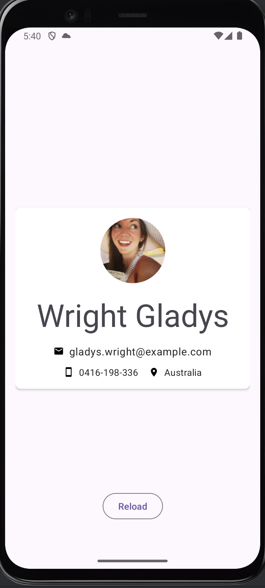

# Андроид-разработчик

## Урок 14. Работа с сетью

### Цели практической работы

- Применить знания по работе с сетью в Android.
- Поработать с REST API, используя библиотеку Retrofit.

### Пример экрана приложения

