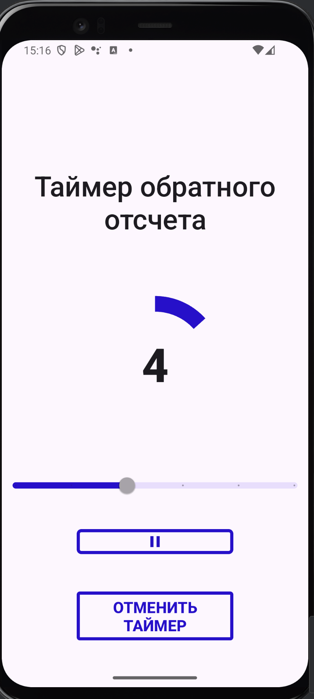

# Андроид-разработчик
## Урок 10. Жизненный цикл приложения

### Цель практической работы
Применить знания по жизненному циклу приложения и сохранению состояния при смене конфигурации.

Что входит в работу
- Разработать приложение «Таймер обратного отсчёта».
- Доработать приложение «Таймер обратного отсчёта».

### Пример экрана приложения

